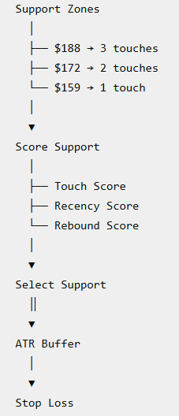

Add Historical prices to Company SDK service

## Preamble

Before moving forward stop here and read the **pre-execution review** document located in this file: 
```code
.github/prompts/_prompt_templates/pre-execution-basic-review.md 
```
and then we can proceed with the prompt below as directed. 

## Role and Objective

You are a Python SDK developer that has been asked to implement a stop-loss capability as a deterministic, horizon-aware quantitative service using OHLCV data. The OHLCV data will be returned from company's get_historical_pricing method in the fmp-company.py provider.

### SDK Class to be created
- **Create Class** CalculationService in **file** calculation_service.py file

### SDK Class Methods to be created
- **Method:** get_stop_loss() 
  - **Description** - calculates stop loss for a company based on SHORT, MEDIUM, and LONG term horizons
  - **Inputs**: list of stock symbols (up to 10), list of horizons
  - **Response**: returns stopLoss result using the JSON structure found in the section "Sample JSON response for get_stop_loss()".
   
**Context:**
- Architecture:       	.github/copilot-instructions.md
- SDK Design:        	  .github/copilot-instructions.md
- Exception Handling:	 .github/prompts/exception_management/exception_management.md
- SDK Services Directory  src/mi_sdk/services
- SDK Test Directory    tests/sdk
- FMP providers Directory  src/mi_sdk/providers/fmp

## Constraints:
- Must follow .github/copilot-instructions.md
- Must not expose provider-specific logic in the SDK service

## Response:

**Sample JSON response for get_stop_loss()**

Ignore data values as this is mock data. 

```json
{
  "companies": [
  {
    "symbol": "NVDA",
    "currentPrice": 200.00,
    "horizons": {
      "SHORT": {
        "stopLoss": {
          "price": 185.00,
          "downsidePct": 7.50,
          "method": "SUPPORT_ATR"
        },
        "support": {
          "price": 188.00,
          "strength": 0.84,
          "touches": 3
        },
        "volatility": {
          "atr": 6.00,
          "atrPeriod": 14,
          "atrTimeframe": "DAILY",
          "bufferMultiplier": 0.50
        }
      },
      "MEDIUM": {
        "stopLoss": {
          "price": 172.00,
          "downsidePct": 14.00,
          "method": "SUPPORT_ATR"
        },
        "support": {
          "price": 176.00,
          "strength": 0.79,
          "touches": 4
        },
        "volatility": {
          "atr": 5.33,
          "atrPeriod": 20,
          "atrTimeframe": "DAILY",
          "bufferMultiplier": 0.75
        }
      },
      "LONG": {
        "stopLoss": {
          "price": 155.00,
          "downsidePct": 22.50,
          "method": "SUPPORT_ATR"
        },
        "support": {
          "price": 162.00,
          "strength": 0.88,
          "touches": 3
        },
        "volatility": {
          "atr": 7.00,
          "atrPeriod": 14,
          "atrTimeframe": "WEEKLY",
          "bufferMultiplier": 1.00
        }
      }
    }
  },
  {
    "symbol": "AAPL",
    "currentPrice": 181.00,
    "horizons": {
      "SHORT": {
        "stopLoss": {
          "price": 178.00,
          "downsidePct": 7.50,
          "method": "SUPPORT_ATR"
        },
        "support": {
          "price": 180.00,
          "strength": 0.84,
          "touches": 3
        },
        "volatility": {
          "atr": 6.00,
          "atrPeriod": 14,
          "atrTimeframe": "DAILY",
          "bufferMultiplier": 0.50
        }
      },
      "MEDIUM": {
        "stopLoss": {
          "price": 172.00,
          "downsidePct": 14.00,
          "method": "SUPPORT_ATR"
        },
        "support": {
          "price": 176.00,
          "strength": 0.79,
          "touches": 4
        },
        "volatility": {
          "atr": 5.33,
          "atrPeriod": 20,
          "atrTimeframe": "DAILY",
          "bufferMultiplier": 0.75
        }
      },
      "LONG": {
        "stopLoss": {
          "price": 155.00,
          "downsidePct": 22.50,
          "method": "SUPPORT_ATR"
        },
        "support": {
          "price": 162.00,
          "strength": 0.88,
          "touches": 3
        },
        "volatility": {
          "atr": 7.00,
          "atrPeriod": 14,
          "atrTimeframe": "WEEKLY",
          "bufferMultiplier": 1.00
        }
      }
    }
  },
    ], 
    "errors": [
    ...
  ],
}
```

## Implementation Details

Define the following StopLossConfig using Pydantic Settings.

```python
class StopLossSettings(BaseSettings):
    # short horizon: 1-3 months
    short_atr_period: int = 14
    short_atr_buffer: float = 0.50

    # medium horizon: 3-6 months
    medium_atr_period: int = 20
    medium_atr_buffer: float = 0.75

    # medium horizon: 6-18 months
    long_atr_period: int = 14     
    long_atr_buffer: float = 1.00
```
Each Horizon indicates the planned approximate holding period for the given stock.

Create class to define horizons as ENUM
```python
class InvestmentHorizon(str, Enum):
    SHORT = "SHORT"      # intended holding period: ~1-3 months
    MEDIUM = "MEDIUM"    # intended holding period: ~3-6 months
    LONG = "LONG"        # intended holding period: ~6-18 months
```

Below are starting configuration values. They are not claims that they're optimal.

These starting value can be used until backtesting can be done.

| Parameter | SHORT | MEDIUM | LONG |
| --- | --- | --- | --- |
| Holding horizon | 1–3 months | 3–6 months | 6–18 months |
| Historical lookback | 6 months | 12 months | 36 months |
| OHLCV timeframe | Daily | Daily | Weekly |
| ATR period | 14 daily bars | 20 daily bars | 14 weekly bars |
| ATR buffer multiplier | 0.50 | 0.75 | 1.00 |
| Swing window | 2 | 2 | 2 |

Before fetching the OHLCV historical data, decide the lookback period based on the longest horizon in the parameter list.  For Example

- If request is for SHORT horizon,    fetch on 6 months of historical data.
- If request is for SHORT and MEDIUM  horizon, fetch on 12 months of historical data.
- If request is for MEDIUM horizon,   fetch on 12 months of historical data.
- If request is for SHORT and LONG horizon,  fetch on 36 months of historical data.
- If request is for LONG and MEDIUM horizon,  fetch on 36 months of historical data.


Consider using following code as an approximate example of the swing low algorithm

```python
from dataclasses import dataclass
from datetime import date

@dataclass(frozen=True)
class PriceBar:
    date: date
    low: float

@dataclass(frozen=True)
class SwingLow:
    date: date
    price: float
    index: int

def find_swing_lows(
    bars: list[PriceBar],
    window: int = 2
) -> list[SwingLow]:

    swing_lows = []

    if len(bars) < (window * 2) + 1:
        return swing_lows

    for i in range(window, len(bars) - window):

        current_low = bars[i].low

        left_lows = [
            bars[j].low
            for j in range(i - window, i)
        ]

        right_lows = [
            bars[j].low
            for j in range(i + 1, i + window + 1)
        ]

        if (
            current_low < min(left_lows)
            and current_low < min(right_lows)
        ):
            swing_lows.append(
                SwingLow(
                    date=bars[i].date,
                    price=current_low,
                    index=i
                )
            )

    return swing_lows
```
Set window = 2

Make window configurable so It can potentially change after backtesting.

Place the swing-low window in your stop-loss configuration, alongside your ATR parameters:

STOP_LOSS_SHORT_SWING_WINDOW=2

STOP_LOSS_MEDIUM_SWING_WINDOW=2

STOP_LOSS_LONG_SWING_WINDOW=2

Initially set all three at 2

Recommendation is 

- 5-bar swing low / window = 2
  
Use it for both daily and weekly bars, make the window configurable, and don't try to make the swing-low algorithm itself horizon-aware yet. Horizon awareness comes from which OHLCV timeframe/lookback you feed into it. Then let your later backtesting determine whether different window sizes improve the three horizons.

## Usage
The stop loss SDK result will be used by another SDK to calcuate risk-reward.
This service will also be used by various Agentic workflow as needed.

## Business Logic
Business Logic Pipeline is as follows:



### The Approach
The following approach will be used to calculate Stop Loss.
- Structural support + ATR volatility buffer
  
First determine meaningful technical support from historical prices. Then place the stop slightly below that support, with the distance below support determined by ATR.

Conceptually:
- Stop=Support-ATRBuffer
  
Where:
- ATRBuffer=ATRBufferMultiplier
  
Suppose:
  - Current/entry price = $100
  - meaningful support = $91
  - ATR = $3
  - support buffer = 0.5 ATR

Then: [ Stop = 91-(3\times0.5)=$89.50 ]

This reflects two separate pieces of information:

$91 → the market's price structure.
$1.50 buffer → normal volatility around that structure.

### Create algorithm for Local Low
For V1, keep the swing-low algorithm deterministic, simple, and configurable. You don't need a sophisticated technical-analysis library yet.

I recommend a 5-bar confirmed swing-low algorithm.

#### V1 Swing-Low Definition

For each daily or weekly OHLCV bar at index i, declare i a swing low when its low is lower than the lows of the two bars immediately before it and two bars immediately after it:

\[
SwingLow(i)=
L_i < L_{i-1}
\land
L_i < L_{i-2}
\land
L_i < L_{i+1}
\land
L_i < L_{i+2}
\]

For example:

| Day  |     Low |            |
|------|---------|------------|
| 1    |    $103 |            |
| 2    |    $101 |            |
| 3    |     $97 | <-candidate|
| 4    |     $99 |            |
| 5    |    $102 |            |


### Cluster swing lows into support zones
Do not treat:

$90.85
$91.14
$90.97

as three support levels.

They represent approximately:
- $91 support

Cluster nearby swing lows using a volatility-normalized tolerance.

For example:

- |Lowi-Lowj|<0.5ATR
  
could identify them as belonging to the same support zone.

This is preferable to a fixed $1 tolerance because $1 means something completely different for a $20 stock than for a $500 stock.

### Score support strength

For each support zone calculate something like:

- SupportScore=f(Touches, Recency, ReboundStrength)

Mathematically it would be an actual weighted score

\[
SupportScore =
w_T(TouchScore)+
w_R(RecencyScore)+
w_B(ReboundScore)
\]

where

\[
w_T+w_R+w_B=1
\]

For an initial implementation, start with something like:

Touches          40%
Recency          30%
Rebound Strength 30%

Giving

\[
\boxed{
SupportScore =
0.40(TouchScore)+
0.30(RecencyScore)+
0.30(ReboundScore)
}
\]

These weights are not final. They're starting parameters that can eventually be validated/backtested and adjusted as needed.

### Make support horizon aware

Suppose NVDA has:

- Current price      $200

- Recent support     $188
- Medium support     $172
- Major support      $148

MI should not automatically choose $188 for every investor.

Instead:

**SHORT — 1–3 months**

Look for recent daily support:

Candidate: $188

**MEDIUM — 3–12 months**

Look for stronger daily/weekly structure:

Candidate: $172

**LONG — 12–18 months**

Look for major weekly structural support:

Candidate: $148

This is the mechanism that makes your stop-loss service genuinely horizon-aware.

### Calculate ATR
Calculate ATR appropriate to the timeframe.

True Range is:

TR=(High-Low,|High-PreviousClose|,|Low-PreviousClose|)

ATR is a smoothed average of True Range. Fidelity notes that ATR is commonly calculated over 14 periods and can use daily, weekly or monthly periods; it also suggests longer averaging periods when measuring longer-term volatility

Consider using libraries like pandas-ta to calculate ATR if you think its helpful and can potentially be used for other calculations in the future.
Let me know if you need me to install the pandas libary in the marketinsights virtual environment. If so provide installation command.

### Put the stop below support
Now combine structural and volatility information.

For example:

- Entry               $200
- Support              $188
- ATR                    $6

Buffer multiplier     0.5

Then:

\[ Buffer=6\times0.5=\$3 \]

and:

\[ Stop=188-3=\boxed{\$185} \]

Risk:

\[ \frac{200-185}{200}=7.5\% \]

Now MI can explain exactly why it chose $185:

$188 represents recent technical support. A $3 volatility allowance was placed beneath support based on 0.5 × ATR.

That explainability is valuable when an LLM eventually consumes this service.

## Validation Logic

The get_stop_loss() method can accept upto 10 symbols and multiple horizons.
If more than 10 symbols are provided, raise 'BAD REQUEST' error.

The only acceptable values for horizons is one of or combination of SHORT, MEDIUM, and LONG. The values are not required to be case sensitive. 
The get_stop_loss() will convert the horizons to upper case to work with the internally defined ENUM.


## Exceptions
Have the Company SDK employ the Exception handling pattern for SDK services, that is documented in file 
```code .github/prompts/exception_management/exception_management.md.```

## Testing

- Create test file “test_calculation_service.py” in the SDK Test directory. 
- Include following tests:
  - One to handle get_stop_loss() for AAPL and horizons SHORT
  - One to handle get_stop_loss() for AAPL and horizons SHORT,MEDIUM
  - One to handle get_stop_loss() for IBM and horizons SHORT,MEDIUM,LONG 
- Add a docstring on top of the file with the both the gitbash and windows powershell syntax for running the test.


