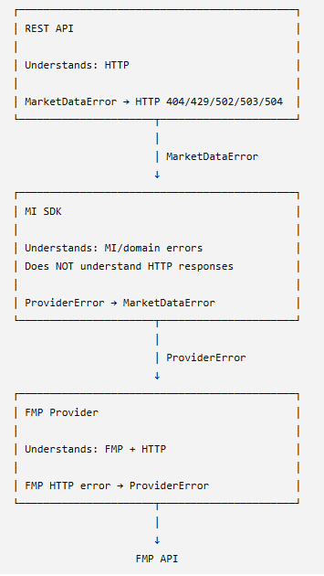
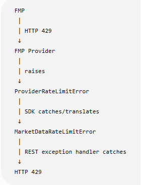

## MI Layered archicture
<pre>
Rest API Layer
    ||
    \/
MI SDK Layer
    ||
    \/
FMP Provider
    ||
    \/
FMP HTTP API
</pre>

### MI Type of Errors:  
- ProviderError 
- MarketDataError



### Provider Exception Class
```python
class ProviderError(Exception):
    def __init__(
        self,
        message: str,
        provider: str,
        error_code: str,
        status_code: int | None = None,
        retryable: bool = False,
    ):
        super().__init__(message)
        self.message = message
        self.provider = provider
        self.error_code = error_code
        self.status_code = status_code
        self.retryable = retryable
```

This Python class defines a **custom exception** designed to handle failures when interacting with external providers (eg FMP).

Instead of raising a generic error, this custom error captures structured metadata about *what* went wrong and *where*.

The class is located in: src/mi_sdk/providers/common/exceptions.py

#### Attributes:

Attaches each value to the exception instance, allowing upstream code to inspect these details programmatically.

* `message: str` — A human-readable description of the error.
* `provider: str` — The name of the third-party service (e.g., `"openai"`, `"stripe"`).
* `error_code: str` — A specific internal error identifier from the provider (e.g., `"rate_limit_exceeded"`, `"insufficient_funds"`).
* `status_code: int | None = None` — The HTTP status code returned by the API (e.g., `404`, `500`), defaulting to `None` if not an HTTP error.
* `retryable: bool = True` — A flag indicating whether the operation can be safely retried immediately or after a delay. Default value is True.

Note that the HTTP status_code travels with the exception as diagnostic metadata, even though the SDK isn't HTTP-aware. 


### Example Usage

#### Raising the exception:

```python
raise ProviderError(
    message="API request timed out while connecting to OpenAI.",
    provider="OpenAI",
    error_code="TIMEOUT",
    status_code=504,
    retryable=True
)
```

#### Catching and using the metadata:

```python
try:
    # Code making an external API call
    call_external_service()
except ProviderError as err:
    print(f"Error from {err.provider}: {err.message}")
    
    # Conditional logic based on error attributes
    if err.retryable:
        print("Retrying request...")
    else:
        print(f"Failed permanently with code: {err.error_code}")
```
---

### MarketData Exception Class

```python
class MarketDataError(Exception):
    def __init__(
        self,
        message: str,
        error_code: str,
        provider: str | None = None,
        provider_status_code: int | None = None,
        retryable: bool = False,
    ):
        super().__init__(message)
        self.message = message
        self.error_code = error_code
        self.provider = provider
        self.provider_status_code = provider_status_code
        self.retryable = retryable
```

This class is located in:  src/mi_sdk/services/exceptions.py

When Calling an provider (eg. FMP provider),  you would do following:
```python
try:
    return fmp_provider.get_company_profile(symbol)

except ProviderError as exc:
    raise MarketDataError(
        message=exc.message,
        error_code=exc.error_code,
        provider=exc.provider,
        provider_status_code=exc.status_code,
        retryable=exc.retryable,
    ) from exc
```

### REST API Translates SDK Exception to HTTP Response

This is where the HTTP semantics come in.

With the FASTAPI, we would do the following:

```python
@app.exception_handler(MarketDataError)
async def market_data_error_handler(
    request: Request,
    exc: MarketDataError,
):
    status_code = map_error_to_http_status(exc.error_code)

    return JSONResponse(
        status_code=status_code,
        content={
            "error": {
                "code": exc.error_code,
                "message": exc.message,
                "provider": exc.provider,
                "retryable": exc.retryable,
            }
        },
    )
```

Behind the scenes, Starlette, the lower-level ASGI web framework, is doing much of the work necessary to turn that JSONResponse into an actual HTTP response.

The mapping of error code to status code is done in following method

```python
def map_error_to_http_status(error_code: str) -> int:
    return {
        "BAD_REQUEST": 400,
        "INVALID_API_KEY": 401,
        "FORBIDDEN_PLAN_LIMIT": 403,
        "SYMBOL_NOT_FOUND": 404,
        "RATE_LIMIT_EXCEEDED": 429,
        "PROVIDER_UNAUTHORIZED": 502,
        "PROVIDER_TIMEOUT": 504,
        "PROVIDER_UNAVAILABLE": 503,
        "PROVIDER_ERROR": 502,
    }.get(error_code, 500)
```

---

### Below is what SDK would do using the Company SDK as an example

The SDK catches a Provider error, maps to a MarketData Error and raises
a MarketData Exception so I can be handled by the API.

```python
from providers.common.exceptions import ProviderError
from exceptions import MarketDataError

class CompanyService:

    def get_profile(self, symbol: str):

        try:
            return self.provider.get_company_profile(symbol)

        except ProviderError as exc:
            raise MarketDataError(
                message=exc.message,
                error_code=exc.error_code,
                provider=exc.provider,
                provider_status_code=exc.status_code,
                retryable=exc.retryable,
            ) from exc
```

The REST API layer only knows about SDK exceptions, which are MarketData errors, hence it would do the following:
```python
from market_insights.sdk.exceptions import MarketDataError

@app.exception_handler(MarketDataError)
async def market_data_error_handler(
    request: Request,
    exc: MarketDataError,
):

```

The REST layer should not import ProviderError, and the FMP provider should not import MarketDataError.

----

### How to handle sparse errors in a multi-symbol request

If you submit a multiple symbol request and 2 out of 10 fail, the error object should return an array with one error object for each symbol that failed and a summary property at the end. See example below

```json
{
  "companies": [
    {
      "symbol": "NVDA",
      "companyName": "NVIDIA Corporation",
      "price": 185.42,
      "sector": "Technology"
    },
    {
      "symbol": "IBM",
      "companyName": "International Business Machines",
      "price": 281.10,
      "sector": "Technology"
    }
  ],
  "errors": [
    {
      "symbol": "BAD1",
      "code": "SYMBOL_NOT_FOUND",
      "message": "Symbol BAD1 was not found.",
      "retryable": false
    },
    {
      "symbol": "BAD2",
      "code": "PROVIDER_TIMEOUT",
      "message": "Unable to retrieve market data for BAD2.",
      "retryable": true
    }
  ]
}
```

To support this structure include a summary property. Below is an example summary report

```json
{
  "companies": [
    ...
  ],
  "errors": [
    ...
  ],
  "summary": {
    "requested": 10,
    "successful": 8,
    "failed": 2
  }
}
```
All three properties: companies, errors, and summary should be included  all responses.

Below is an example of a fully successful request.

```json
{
  "companies": [
    {"symbol": "NVDA", "companyName": "NVIDIA Corporation"},
    {"symbol": "IBM", "companyName": "International Business Machines"}
  ],
  "errors": [],
  "summary": {
    "requested": 2,
    "successful": 2,
    "failed": 0
  }
}
```

**This is basic rule for populating error object**
- companies contains only successful results.
- errors contains one entry per failed symbol.
- successful + failed = requested.
- If every symbol fails, return companies: [] with the errors and summary populated.

**This is basic rule for handling duplicate symbols**
Define how duplicate symbols are handled so the counts remain predictable. I’d deduplicate before processing and count the unique symbols requested.

---

### Implementation recommendation for SDK service

For the MI architecture, the SDK batch service should assemble this response, catching each provider failure and translating it into a per-symbol error. The individual provider call can continue raising ProviderError. Reserve the singular top-level error construct for failures that prevent the entire batch from being processed, such as an invalid request format.

Create a **reusable batch-result handler**, with a small exception-to-error conversion function. This separates two responsibilities:
- Error conversion: Translate a ProviderError into a consistent per-symbol error containing symbol, code, message, and retryable.
- Batch policy: Decide what to return when some or all symbols fail, preserve successful results, and calculate summary.
Each SDK service could use the same handler while supplying its own respective data (eg. earnings, analyst targets, etc).
The **reusable batch-result handler** can reside in src/mi_sdk/services/batch-result-handler.py.

Use following as the default policy
| Situation | SDK Behavior | REST Behavior | HTTP |
|---|---|---|---:|
| 10 requested, 10 successful | Return normal result | Return response | 200 |
| 10 requested, 8 successful, 2 item failures | Return results + `errors[]` | Return response | 200 |
| 10 requested, 0 successful because all symbols invalid | Return `errors[]` containing 10 item errors | Return response | 200 |
| FMP completely unavailable | Raise `MarketDataError` | Exception handler | 503 |
| FMP times out for entire operation | Raise `MarketDataError` | Exception handler | 504 |
| Invalid MI REST request | Doesn't reach SDK | REST validation | 400/422 |
| MI authentication fails | Doesn't reach SDK | REST authentication | 401 |

Keep this shared logic in the SDK layer. Providers raise ProviderError; the SDK translates and aggregates them; the API handles HTTP responses.

The Mechanism column in table above is meant to convery how the condition is communicated back to the REST API layer.

Provider failures that prevent the SDK operation from producing a usable result should be translated into MarketDataError. Individual item failures in a batch operation can be captured as result data rather than raised as exceptions.

For example, suppose the SDK method is:
```python
result = company_service.get_summaries(
    ["NVDA", "IBM", "MSFT", "BAD1", "AAPL"]
)
```
If BAD1 doesn't exist, the SDK can internally encounter a ProviderError, but instead of allowing that one symbol to terminate processing of all five symbols, it catches it:
```python
for symbol in symbols:
    try:
        company = provider.get_company_summary(symbol)
        companies.append(company)

    except ProviderError as exc:
        errors.append(
            ItemError(
                symbol=symbol,
                code=exc.error_code,
                message=exc.message,
                retryable=exc.retryable,
            )
        )
```

Then the SDK returns:
```python
CompanySummaryResult(
    companies=companies,
    errors=errors
)
```

No MarketDataError escapes the SDK because the SDK successfully completed the batch operation, albeit with partial results.

By contrast, suppose FMP itself is unavailable:

FMP → 503

and therefore the SDK cannot reasonably process the batch. Then:

```python
except ProviderUnavailableError as exc:
    raise MarketDataError(
        message="Market data provider is unavailable",
        error_code="PROVIDER_UNAVAILABLE",
        provider=exc.provider,
        provider_status_code=exc.status_code,
        retryable=True,
    ) from exc
```
That propagates:

FMP 503
   ↓
ProviderError
   ↓
MarketDataError
   ↓
REST exception handler
   ↓
HTTP 503

### One final note
If every symbol fails with an item-level error, return companies: [] with populated errors and summary. Operation-wide failures follow the policy table provided above.

For implementation, a single symbol’s timeout or HTTP 503 should remain an item error when other symbols succeed. It should not, by itself, classify the entire operation as unavailable.


---

### How to extend Exception Hierarchy for Provider specific errors in the future, as needed.

Below is example of extending the class hierarchy for 
provider-specific errors. You can create subclasses for each provider 
to handle their specific error codes and messages. 

```python
class ProviderRateLimitError(ProviderError):

    def __init__(
        self, 
        message: str,
        provider: str,
        status_code: int | None = None,
    ):
    super().__init__(
        message=message,
        provider=provider,
        error_code="PROVIDER_RATE_LIMIT_EXCEEDED",
        status_code=status_code,
        retryable=True,
    )
```

### How to extend Exception Hierarchy for the SDK specific errors in the future, as needed.

```python
class MarketDataError(Exception):
    ...

class MarketDataRateLimitError(MarketDataError):

    def __init__(
        self,
        message: str,
        provider: str | None = None,
        provider_status_code: int | None = None,
    ):
        super().__init__(
            message=message,
            error_code="RATE_LIMIT_EXCEEDED",
            provider=provider,
            provider_status_code=provider_status_code,
            retryable=True,
        )
```

Now your SDK translates one abstraction into another:

```python
try:
    return self.provider.get_company_profile(symbol)

except ProviderRateLimitError as exc:
    raise MarketDataRateLimitError(
        message=exc.message,
        provider=exc.provider,
        provider_status_code=exc.status_code,
    ) from exc
```

And your REST API can specifically handle it:

```python
@app.exception_handler(MarketDataRateLimitError)
async def rate_limit_error_handler(
    request: Request,
    exc: MarketDataRateLimitError,
):
    return JSONResponse(
        status_code=429,
        content={
            "error": {
                "code": exc.error_code,
                "message": exc.message,
                "retryable": exc.retryable,
            }
        },
    )
```
### Below is the complete flow



Understand that if FMP returns a 429 error ("Too many requests"), does it makes sense for REST API to return same error to client. 
Perhaps not, because it is a limitation that you as the  MarketData Provider encountered with FMP. The client can misinterpret this as they exceeded number of requests.

In this situation, the MI client hasn't necessarily done anything wrong; your downstream FMP dependency is rate-limited.

I would consider translating the 429 error to a 503 error message something like "Market data is temporarily unavailable."

```json
{
  "error": {
    "code": "MARKET_DATA_RATE_LIMITED",
    "message": "Market data is temporarily unavailable.",
    "retryable": true
  }
}
```
Internally, your logs could retain:
```code
provider = FMP
provider_status_code = 429
```
without exposing FMP implementation details to consumers.

That distinction will become especially valuable if MI eventually uses multiple providers, because your REST API contract remains stable regardless of whether the underlying failure came from FMP, Yahoo, Polygon, or another market-data provider.


