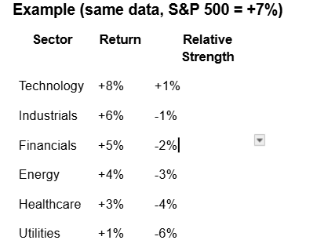

Context: 
- Architecture:       docs/sdk-architecture.md
- SDK Design:         docs/sdk-architecture.md
- Exception Handling: docs/exception-handling.md

Task: 
You are an SDK developer. Modify the SDK sector_performance_service (in services directory) and fmp_adapter (in providers directory) so that it returns both sector performance and relative strength for  SPDR ETF tickers: XLK, XLF, XLV, XLY, XLI, XLC, XLE, XLU, XLP, XLB, XLRE
Below is an example that uses the S&P 500 as the base for calculating relative strength.

Constraints:
- Must follow .github/copilot-instructions.md
- Must not expose provider-specific logic in the SDK service

