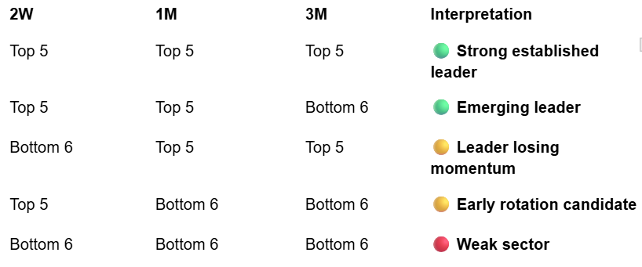

**Role and Description of task** 

You are a Python SDK developer.  
Create a sector leadership SDK that uses the output from the sector summary SDK
to determine the top 5 leading sectors by relative strength.  The sector_summary_service.py file can be found in the SDK directory.

**Context** 
- Standards: 		.github/copilot-instructions.md
- Architecture:		docs/mi_api/architecture.md
- SDK Design:         	docs/sdk/architecture.md
- SDK Directory:	src/mi_sdk
- SDK Test directory: 	tests/sdk
- Exception Handling: 	docs/exception-handling.md

**Business Logic**

To determine sector leadership call the sector summary sdk passing in the following periods: 2W, 1M, and 3M.  These periods will be used to determine the sector leadership qualification.

We are using the 1M period as the anchor, 2W as the momentum signal, and 3M as the confirmation signal. The sector ranking should be based on relative strength versus the S&P/SPY.

The thought is to classify the sectors along these lines:


Below is sample interpretation logic 

```python
def interpret_sector_leadership(
    rank_2w: int,
    rank_1m: int,
    rank_3m: int,
    top_n: int = 5,
) -> str:
    top_2w = rank_2w <= top_n
    top_1m = rank_1m <= top_n
    top_3m = rank_3m <= top_n

    if top_2w and top_1m and top_3m:
        return "strong_established_leader"

    if top_2w and top_1m and not top_3m:
        return "emerging_leader" 

    if not top_2w and top_1m and top_3m:
        return "leader_losing_momentum"

    if top_2w and not top_1m and not top_3m:
        return "early_rotation_candidate"

    return "non_leading_sector"
```

If a sector does not match one of the above defined patterns, classify it as Mixed/Transitional.

If two sectors have the same relative strength, do not assign both sectors the same rank. 

Use the sector “return rank” for the same period to break the tie.
- For a 2W ranking tie, compare 2W sector return rank. 
- For a 1M ranking tie, compare 1M sector return rank.
- For a 3M ranking tie, compare 3M sector return rank.

The sector with the higher number of “return rank” out of the three periods wins the tie. For example, if XLK and XLC had the same relative strength and XLK performance rank was higher in 2 or 3  out of the 3 periods, XLK wins.
If the tie cannot be broken using return rank, use this deterministic final fallback: order by sector symbol or canonical sector name alphabetically. 

**Sample URL Requests**

- GET /api/v1/sector/leadership?periods=2W,1M,3M&top_n=3
- GET /api/v1/sector/leadership?periods=2W,1M,3M&top_n=5


**Sample JSON response structure**

```json
{
  "benchmark": "SPY",
  "asOfDate": "2026-09-06",
  "requestedSectorCount": 11,
  "successfulSectorCount": 11,
  "failedSectorCount": 0,
  “sectors”: [
      {
  "symbol": "XLK",
  "sector": "Technology",
   "relativeStrengthRank": 1,
   "returnRank": 3,
   "outperformedBenchmark": true
               "interpretation": {
   "status": "strong_established_leader",
    "supports_entry": true,
    "reason": "Sector ranks in the top 5 across 2W, 1M, and 3M."
  	    }
      },
      {
  "symbol": "XLI",
  "sector": "Industrials",
   "relativeStrengthRank": 2,
   "returnRank": 3,
   "outperformedBenchmark": true
               "interpretation": {
   "status": "strong_established_leader",
    "supports_entry": true,
    "reason": "Sector ranks in the top 5 across 2W, 1M, and 3M."
  	    }
      },
     {
	< 3rd entry here structured same as 1st and second entry>
      },
      {
	< if using top_n=5, the 4th and 5th entry will be structured same as 1st and second entry>
      }
],
“errors”: [
	<this will show the errors that were raised as part of the SDK call to sector summary>
]
```
     
**Testing**

- Create a separate test file “test_sector_leadership_service.py” in the SDK Test directory. 
- Include two tests. 
  - One to handle the periods=2W,1M,3M and top_n=3 and 
  - the other to handle periods=2W,1M,3M and top_n=5. 
- Add a docstring on top of the file with the syntax for running the test.

