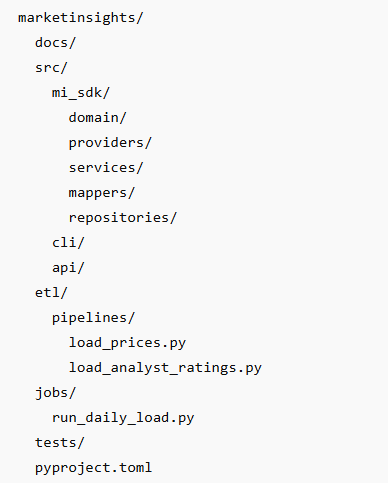

### Data management architecture
#### Schema Changes
- Alembic

#### API to market data migrations
- Custom Python ETL
  - #### Allows you to do following
    - normalize provider response
    - calculate indicators
    - enrich with LLM analysis
    - store in postgreSQL

#### High volume CSV loads
- PostgreSQL native COPY

### Folder Structure incorporating the etl and jobs folders 

### Folder structure separation of concerns
- src/mi_sdk/     reusable library logic
- src/cli/        command-line interface that calls mi_sdk
- etl/            ETL workflows that call mi_sdk
- jobs/           scheduled job entry points that call etl and mi_sdk

### General rule of thumb
- Business logic → mi_sdk
- HTTP endpoints → api
- Terminal commands → cli
- Data workflows → etl
- Scheduled execution → jobs
