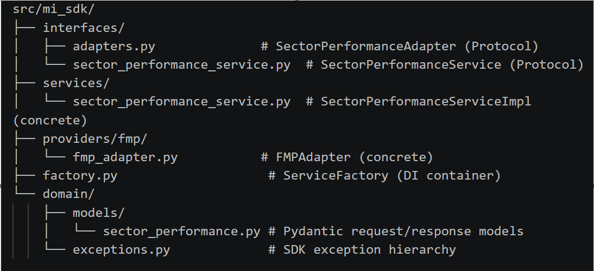
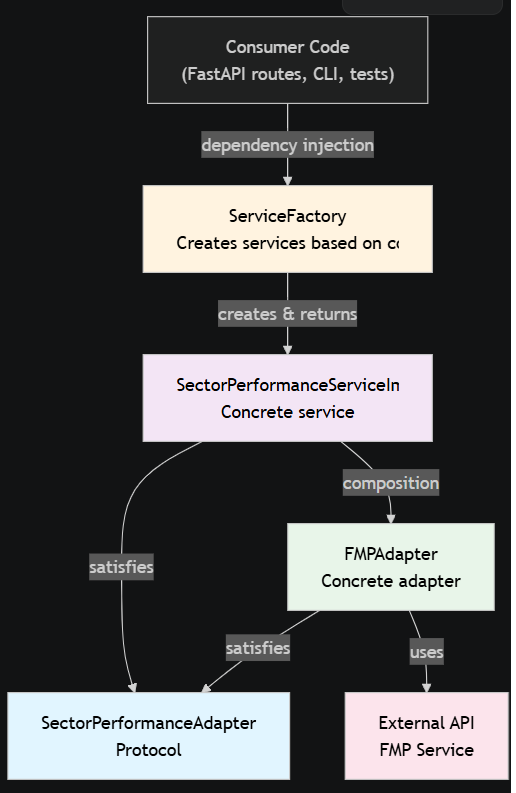

## Architecture
- The SDK is provider-agnostic.
- Public interfaces must not expose provider-specific names such as FMP or AlphaVantage.
- Use domain-oriented service names such as SectoryService, PricingService, EarningsService, AnalystService, and TechnicalIndicatorService.
- Provider-specific adapters belong under internal provider packages.

## Python standards
- Use Python 3.12+
- Prefer type hints everywhere
- Prefer small service classes and dependency injection
- Use Pydantic v2 for API request/response models and configuration
- Use Async services for all calls to REST / API providers
- Keep core SDK domain logic decoupled from FastAPI

## Configuration management
- use pydantic-settings for configuration management
  
- use dotenv to manage enviroment variables 
  - Example
    - MARKET_PROVIDER=fmp
    - FMP_API_KEY=your_key_here
    - ALPHAVANTAGE_API_KEY=your_key_here
    - REQUEST_TIMEOUT=30

## Error handling
- Use SDK exception hierarchy rather than ad hoc ValueError/RuntimeError, for example
  - SdkError
  - ConfigurationError
  - AuthenticationError
  - AuthorizationError
  - RateLimitError
  - ProviderUnavailableError
  - DataValidationError
  - SymbolNotFoundError
  - UnsupportedOperationError
- Do not leak provider-specific exceptions past the adapter layer

## Testing
- Generate pytest tests for services, adapters, and API routes
- Mock provider adapters in API tests

## SDK Project file Hierarchy

..also available at src/mi_sdk folder in project

## Public API design
Keep the SDK public surface generic and provider-neutral.
That allows for switching providers without changing the application-facing API.

### Example public services:
- PricingService
- EarningsService
- AnalystService
###  Example provider-specific classes should stay internal:
- FmpPricingProvider
- AlphaVantageEarningsProvider

### SDK Architecture with Protocols
SDK uses Protocols instead of ABCs for flexible, composition-based architecture

## Key Principles

Composition over Inheritance: Services and adapters no longer inherit from protocols. Instead, they simply implement the required methods and are recognized as compatible through structural subtyping (duck typing).

Protocols for Type Hints: Protocols define the contract without enforcing inheritance. This enables:

Cleaner code with no boilerplate base class requirements
Natural duck typing that's still type-safe
Easier mocking in tests (no spec= needed for basic protocol compliance)
Dependency Injection: The factory constructs the object graph. Services receive adapters as constructor arguments, keeping concerns decoupled.

Error Handling: Provider-specific exceptions are caught and converted to SDK domain exceptions (ProviderUnavailableError, SymbolNotFoundError) at the adapter boundary.